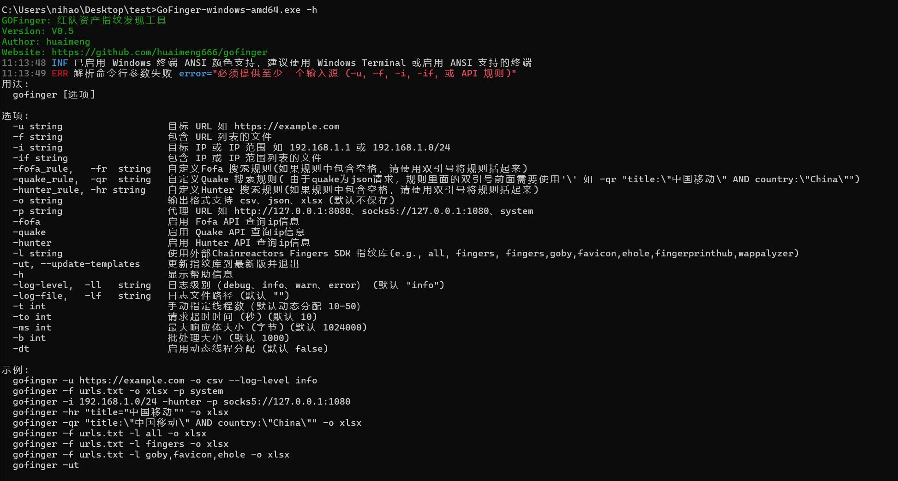
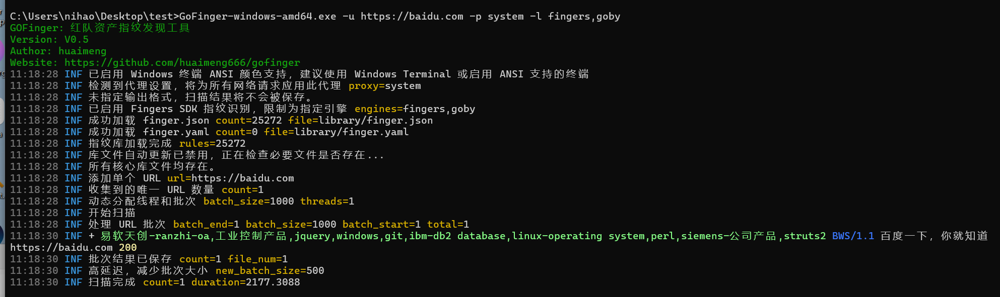
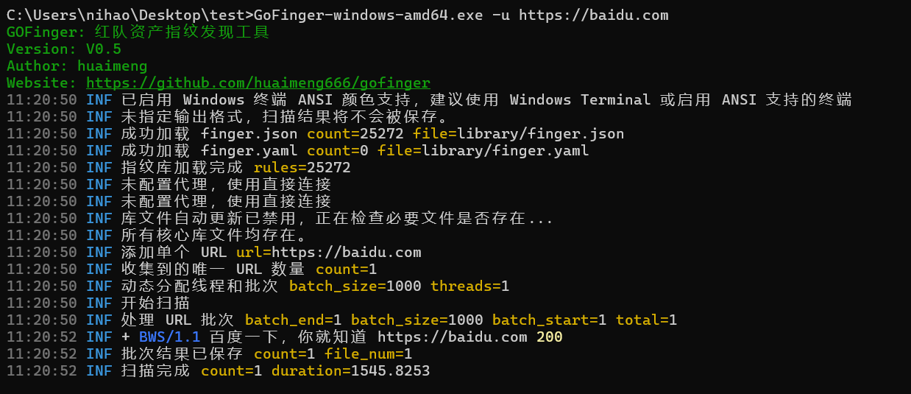
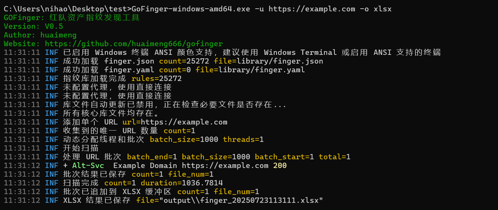
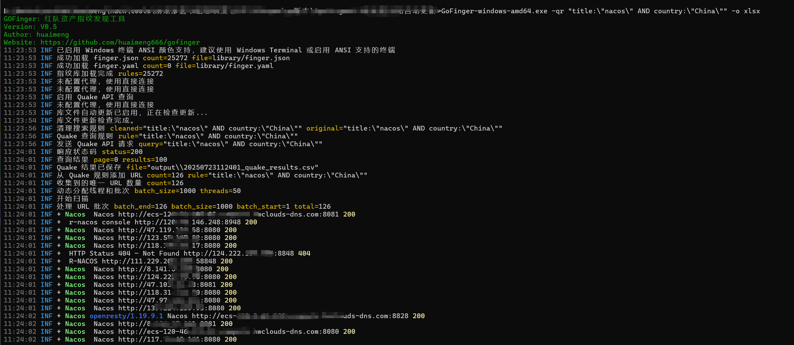
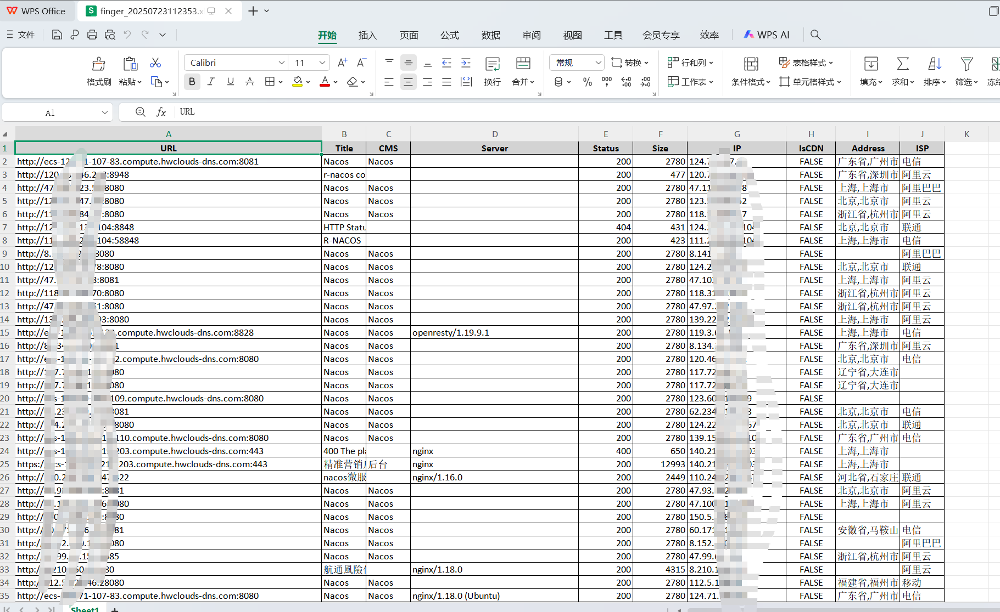
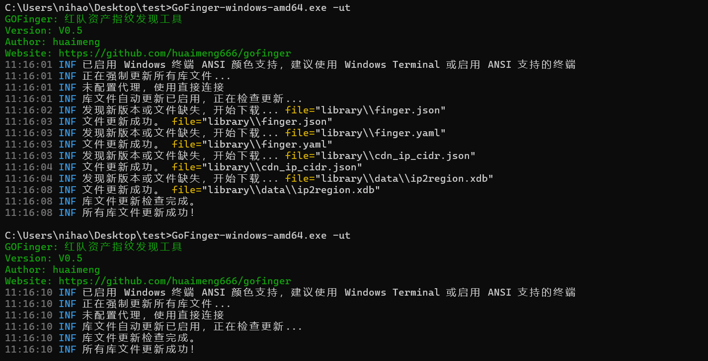

# GoFinger - 红队资产指纹发现与管理利器

## 1. 项目简介

**GoFinger** 是一款专为红队攻防和企业资产管理设计的下一代指纹发现工具。基于 Go 语言开发，它不仅继承了传统指纹工具的识别能力，更在**性能、可扩展性和输出质量**上进行了深度优化。

它旨在帮助安全工程师和渗透测试人员快速、精准地识别网络资产指纹，并以美观、易读的格式呈现结果。工具原生支持本地指纹库与 Fofa、Quake、Hunter 等主流API联动，并集成了 Chainreactors Fingers、Goby、Ehole、Wappalyzer 等多种知名指纹库，是现代网络空间测绘和资产管理不可或缺的瑞士军刀。

- **当前版本**：V0.5(性能优化版)
- **核心作者**：huaimeng
- **项目地址**：[https://github.com/huaimeng666/gofinger](https://github.com/huaimeng666/gofinger)

### ✨ 核心功能亮点

- **多源输入支持**：无缝处理单个URL、IP（含CIDR）、文件列表，并能直接消费 Fofa、Quake、Hunter 的查询结果。
- **多维指纹集成**：原生支持 Chainreactors Fingers、Goby、Ehole、Wappalyzer、Favicon 等多种指纹库，可按需组合，识别维度更广。
- **异步I/O并发引擎**：采用**扫描与写入分离**的并行工作流，彻底消除磁盘I/O瓶颈，大幅提升大规模扫描任务的吞吐量和效率。
- **智能格式化输出**：支持 CSV、JSON（可压缩为.gz）和 XLSX 格式。其中 **XLSX 报告具备智能列宽调整和专业样式**，告别手动调整，结果一目了然。
- **强大代理兼容**：全面兼容 HTTP/HTTPS、SOCKS5 及系统代理，轻松应对复杂的网络环境。
- **完善的日志系统**：提供彩色控制台日志，支持 debug、info、warn、error 四个级别，并可将日志完整输出到文件，便于审计和排错。
- **指纹库自动更新**：内置从 GitHub 自动更新指纹库的机制，确保指纹数据始终保持最新。
- **IP归属与CDN检测**：集成 IP2Region 数据库和智能CDN识别算法，精准判断IP地理位置、ISP及CDN使用情况。

### 🎯 适用场景

- **红队渗透测试**：在攻击前进行快速、全面的资产发现与指纹识别。
- **企业资产管理**：自动化梳理和审计企业暴露在外的网络服务与应用。
- **漏洞应急响应**：在0-day爆发时，快速定位受影响的资产。
- **网络空间测绘**：对特定行业或区域进行大规模的资产信息收集与分类。

## 2. 安装指南

### 环境要求
- **Go 版本**：1.23.0 或更高版本
- **操作系统**：Linux, Windows, macOS (全平台兼容)
- **依赖工具**：`git`
- **网络要求**：稳定的网络连接，用于下载依赖和更新指纹库。
- **磁盘空间**：至少 500MB 可用空间。

### 安装步骤

1.  **下载最新发布项目**
    
    ```bash
    https://github.com/huaimeng666/gofinger
    ```

4.  **测试运行**
    ```bash
    ./finger -h
    ```
    *成功将显示帮助信息，列出所有命令行参数。*

## 3. 配置指南

配置文件位于 `config/config.yaml`，建议在首次运行前根据需求修改。

### 配置项详解

```yaml
# HTTP 请求超时时间（秒）
timeout: 10
# 批处理最大条数，防止内存溢出
batch_size: 2000
# 代理设置，支持 http://, https://, socks5:// 或 system（系统代理）
proxy: ""
# 最大响应体大小（字节），避免过大响应导致内存问题
max_body_size: 1048576

# Fofa API 配置
fofa_base_url: "https://fofa.info"
fofa_email: ""
fofa_key: ""
fofa_size: 100

# Quake API 配置
quake_base_url: "https://quake.360.net"
quake_key: ""
quake_start_time: ""
quake_end_time: ""

# Hunter API 配置
hunter_base_url: "https://hunter.qianxin.com"
hunter_key: ""
hunter_start_time: ""
hunter_end_time: ""

# User-Agent 列表，用于请求伪装
user_agents:
  - "Mozilla/5.0 (Windows NT 10.0; Win64; x64) AppleWebKit/537.36 (KHTML, like Gecko) Chrome/129.0.0.0 Safari/537.36"
  - "Mozilla/5.0 (Macintosh; Intel Mac OS X 14_6_1) AppleWebKit/537.36 (KHTML, like Gecko) Chrome/129.0.0.0 Safari/537.36"

# 是否自动更新指纹库
fingerprint_update: false

# 默认线程数，动态分配时可能被覆盖
threads: 30
# 是否启用动态线程分配
dynamic_threads: true

# 是否压缩 JSON 输出（生成 .gz 文件）
compress_json: true

# 动态性能调整
dynamic_adjustment:
  max_threads: 80
  batch_size_increase_factor: 1.5
  max_batch_size: 5000
  batch_size_decrease_factor: 2.0
  min_batch_size: 100
  low_latency_threshold_ms: 500
  high_latency_threshold_ms: 2000

# 输出设置
output:
  xlsx_split_threshold: 10000
```

### 配置 API 密钥

在使用 Fofa、Quake 或 Hunter API 之前，必须在 `config.yaml` 中配置有效的 API 密钥。例如：

```yaml
fofa_email: "your_email@example.com"
fofa_key: "your_fofa_key"
quake_key: "your_quake_key"
hunter_key: "your_hunter_key"
```

**注意**：密钥需妥善保存，避免泄露。定期检查密钥有效性和配额。

## 4. 使用方法







### 命令行参数详解

| 参数                      | 描述                                            | 默认值   | 示例                                    |
| :------------------------ | :---------------------------------------------- | :------- | :-------------------------------------- |
| `-u`                      | 指定单个 URL                                    | 无       | `-u https://example.com`                |
| `-f`                      | 指定 URL 文件路径                               | 无       | `-f urls.txt`                           |
| `-i`                      | 指定单个 IP 或 IP 段                            | 无       | `-i 192.168.1.1` 或 `-i 192.168.1.0/24` |
| `-if`                     | 指定 IP 文件路径                                | 无       | `-if ips.txt`                           |
| `-fr`, `-fofa_rule`       | 指定 Fofa 查询规则                              | 无       | `-fr domain="example.com"`              |
| `-qr`, `-quake_rule`      | 指定 Quake 查询规则                             | 无       | `-qr title:\"中国移动\"`                |
| `-hr`, `-hunter_rule`     | 指定 Hunter 查询规则                            | 无       | `-hr title="中国移动"`                  |
| `-o`                      | 输出格式 (csv, json, xlsx)                      | 无       | `-o xlsx` (支持智能列宽)                |
| `-p`                      | 代理 URL (http, socks5, system)                 | 无       | `-p socks5://127.0.0.1:1080`            |
| `-fofa`                   | 启用 Fofa API 查询 IP 信息                      | false    | `-i 192.168.1.0/24 -fofa`               |
| `-quake`                  | 启用 Quake API 查询 IP 信息                     | false    | `-i 192.168.1.0/24 -quake`              |
| `-hunter`                 | 启用 Hunter API 查询 IP 信息                    | false    | `-if ips.txt -hunter`                   |
| `-h`                      | 显示帮助信息                                    | 无       | `-h`                                    |
| `-ut, --update-templates` | 更新指纹库到最新版并退出                        | 无       | `-ut`                                   |
| `-l`                      | 使用外部指纹库 (e.g., `all`, `fingers`, `goby`) | 无       | `-l fingers,local`                      |
| `-log-level`              | 日志级别 (debug, info, warn, error)             | `info`   | `-log-level debug`                      |
| `--log-file`              | 指定日志文件路径                                | 无       | `--log-file debug.log`                  |
| `-t`                      | 手动指定线程数                                  | 动态分配 | `-t 50`                                 |
| `-to`                     | 请求超时时间（秒）                              | 10       | `-to 15`                                |
| `-ms`                     | 最大响应体大小（字节）                          | 1048576  | `-ms 2097152`                           |
| `-b`                      | 每批处理大小                                    | 500      | `-b 1000`                               |
| `-dt`                     | 启用动态线程分配                                | `true`   | `-dt`                                   |

### 使用场景与示例

1.  **扫描单个 URL**
    ```bash
    gofinger -u https://example.com -o xlsx
    ```

    
    
2.  **批量扫描 URL 文件**
    
    ```bash
    gofinger -f urls.txt -o csv -t 50
    ```
    
3.  **使用 Hunter API 查询资产**
    
    ```bash
    gofinger  -qr "title:\"nacos\" AND country:\"China\"" -o xlsx
    ```
    
    )
    
    
    
4.  **扫描 IP 段并结合 Quake API**
    
    ```bash
    gofinger -i 192.168.1.0/24 -quake -o csv
    ```
    
5.  **调试模式扫描**
    ```bash
    gofinger -u https://example.com -log-level debug --log-file debug.log
    ```

6.  **混合指纹库扫描**
    
    ```bash
    gofinger -f urls.txt -l goby,ehole,local -o xlsx
    ```

​	使用 Goby 和 E-hole 指纹库进行扫描，如果它们没有识别出结果，则使用本地指纹库进行补充扫描。  

### 输入与输出格式

-   **输入文件**: URL或IP列表，每行一个。
-   **输出文件**: 结果默认保存在 `output/` 目录下，以时间戳命名。支持 `csv`, `json`, `xlsx` 格式，字段包括URL, Title, CMS, Server, Status, Size, IP, IsCDN, Address, ISP等。

### 代理配置

Finger 支持以下代理类型：  

- **HTTP/HTTPS 代理**：`proxy: "http://proxy:port"`  
- **SOCKS5 代理**：`proxy: "socks5://proxy:port"`  
- **系统代理**：`proxy: "system"`（从环境变量或 Windows 注册表读取）。

### 配置示例

在 `config.yaml` 中设置 SOCKS5 代理：  

```yaml
proxy: "socks5://127.0.0.1:1080"
```

通过命令行设置系统代理：  

```bash
gofinger -u https://example.com -p system
```

**注意**：  

- 确保代理服务器稳定，延迟过高可能导致请求超时。  
- 日志会记录代理使用情况，调试时可查看 `-log-level debug`。

## 5. 指纹库管理

### 指纹库结构
指纹库位于 `library/` 目录，包含以下文件：
- `finger.json`: 主指纹库，定义 CMS 识别规则（JSON 格式）。
- `finger.yaml`: 辅助指纹库，格式与 JSON 类似。
- `version.json`: 记录指纹库版本和 MD5 校验值。
- `cdn_ip_cidr.json`: CDN IP 数据库。
- `data/ip2region.xdb`: IP 归属数据库。

### 指纹规则示例
`finger.json` 示例：
```json
{
  "fingerprint": [
    {
      "cms": "seeyon",
      "method": "keyword",
      "location": "body",
      "keyword": ["/seeyon/USER-DATA/IMAGES/LOGIN/login.gif"]
    },
    {
      "cms": "Weblogic",
      "method": "keyword",
      "location": "body",
      "keyword": ["<TITLE>Error 404--Not Found</TITLE>", "<i>Hypertext Transfer Protocol -- HTTP/1.1</i>"]
    },
    {
      "cms": "spring-boot",
      "method": "faviconhash",
      "location": "body",
      "keyword": ["116323821"]
    }
  ]
}
```

- **cms**：目标应用名称。  
- **method**：识别方法（`keyword`、`faviconhash`、`keyword_any`）。  
- **location**：检测位置（`body`、`header`、`title`）。  
- **keyword**：匹配的关键字或哈希值。

### 更新指纹库

#### 自动更新 (v0.5)

1. 命令行直接使用 -ut, --update-templates     更新指纹库到最新版并退出

   

2. 在 `config.yaml` 中启用更新：`fingerprint_update: true`

   运行 goFinger，工具会在启动时检查并下载最新指纹库。

#### 手动更新
1. 从项目仓库的 `library/` 目录下载最新的 `finger.json` 和 `finger.yaml`。
2. 替换本地 `library/` 目录中的对应文件。

## 6. 性能优化：从串行到并行(v0.4)

goFinger V0.4.2 版本开始引入了全新的**异步I/O并发模型**，这是其性能远超传统工具的关键。

-   **传统模式 (串行工作)**: 就像一个厨师，必须**炒完一道菜（扫描），再去洗锅（写入文件）**，然后才能炒下一道。当“洗锅”这个动作很慢时（例如写入大量数据到磁盘），“炒菜”的动作就必须暂停等待，导致效率低下。

-   **GoFinger 的新模式 (并行流水线)**: 我们将“扫描”和“写入”彻底分离，变成了两条并行的流水线。
    1.  **扫描器 (厨师)**: 只专注于最高效地完成网络请求和指纹识别，完成后将结果（炒好的菜）放到一个**传送带 (Channel)** 上，然后立即开始处理下一个目标。
    2.  **写入器 (洗碗工)**: 在后台独立运行，不断从传送带上取下结果，并负责将其写入文件、调整格式。

这种**“扫描-写入”并行处理**的模式，彻底消除了因磁盘I/O造成的性能瓶颈，确保CPU和网络资源始终被充分利用，从而在处理大规模资产时，展现出无与伦比的扫描速度。

### 优化建议

-   **小规模扫描 (< 1000 URLs)**: 保持默认配置即可，程序会自动优化。
-   **大规模扫描 (> 10万 URLs)**:
    -   适当增大批处理大小: `-b 2000`
    -   根据CPU核心数增加线程数: `-t 50` 或更高
    -   启用JSON压缩以节省空间: `compress_json: true` (默认开启)
-   **在低配服务器或不稳定网络下**: 
    -   适当减小线程数: `-t 10`
    -   增加请求超时时间: `-to 20`

## 7. 高级用法

### 结合外部指纹库
使用 `-l` 参数启用 Chainreactors Fingers SDK 等指纹库：
```bash
gofinger -u https://example.com -l fingers,local
```
- `all`: 所有指纹库。
- `fingers`: Chainreactors Fingers。
- `goby`: Goby 指纹库。
- `ehole`: E-hole 指纹库。
- `wappalyzer`: Wappalyzer。
- `elocal`: 使用外部指纹无识别到时补充本地指纹库。

### 自动化脚本集成
将 Finger 集成到自动化脚本中，示例（Bash）：
```bash
#!/bin/bash
urls_file="urls.txt"
output_dir="output"
gofinger -f "$urls_file" -o xlsx -log-level info --log-file "$output_dir/scan.log"
```

## 8. 常见问题与排查 (FAQ)

-   **Q: API 查询失败，提示密钥无效？**
    -   **A**: 检查 `config.yaml` 中的密钥是否正确、账户配额是否耗尽，并可开启 `-log-level debug` 查看详细错误。
-   **Q: 扫描速度慢怎么办？**
    -   **A**: 尝试增加线程数 (`-t 50`)、增大超时时间 (`-to 15`)，或检查代理网络延迟。
-   **Q: 输出文件为空？**
    -   **A**: 检查输入是否有效，API密钥及配额是否正常，并查看调试日志。
-   **Q: 指纹库更新失败？**
    -   **A**: 检查网络连接，或尝试手动更新指纹库。
-   **Q: Windows 下日志无颜色？**
    -   **A**: 建议使用 Windows Terminal 或 PowerShell 7，或执行 `reg add HKCU\Console /v VirtualTerminalLevel /t REG_DWORD /d 1` 启用 ANSI 支持。

## 9. 贡献与支持

我们欢迎任何形式的贡献，无论是提交代码、完善指纹规则，还是报告问题。

1.  **提交 Issue**: 报告 Bug 或提出功能建议。
2.  **提交 Pull Request**: 贡献您的代码或新的指紋规则。
3.  **联系作者**: 通过 GitHub Issue 或项目主页联系 `huaimeng`。

# 免责声明


本工具仅面向**合法授权**的企业安全建设行为，如您需要测试本工具的可用性，请自行搭建靶机环境。

为避免被恶意使用，本项目只进行指纹识别的理论判断，不存在漏洞利用过程，不会对目标发起真实攻击和漏洞利用。

在使用本工具进行检测时，您应确保该行为符合当地的法律法规，并且已经取得了足够的授权。**请勿对非授权目标进行扫描。**

如您在使用本工具的过程中存在任何非法行为，您需自行承担相应后果，我们将不承担任何法律及连带责任。

在安装并使用本工具前，请您**务必审慎阅读、充分理解各条款内容**，限制、免责条款或者其他涉及您重大权益的条款可能会以加粗、加下划线等形式提示您重点注意。

除非您已充分阅读、完全理解并接受本协议所有条款，否则，请您不要安装并使用本工具。您的使用行为或者您以其他任何明示或者默示方式表示接受本协议的，即视为您已阅读并同意本协议的约束。
